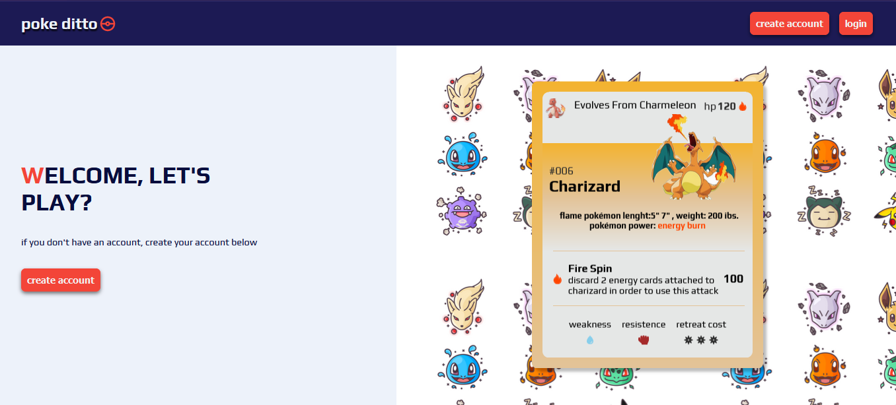
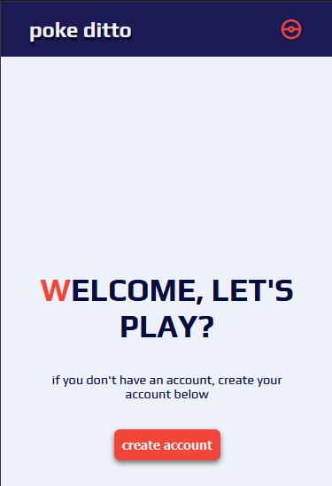

# Title / Pokeditto

## About / Synopsis

* a Pokémon-themed web game to practice the skills learned in the following technologies | react | javascript | HTML | CSS | java | style-components | phaser
* Project status: working

See real examples:

* <https://github.com/jojoee/phaser-examples#readme>

Sample:

# front-end part
* copy the repository through your terminal, then run the `yarn or npm I` command to install the dependencies, then enter the frontend folder and run the `yarn dev `command to run the project

### Screenshots

## About Pokeditto
Pokeditto is a web game, developed with technologies such as react, javascript, HTML, CSS, styled-components on the front end, and technologies like java, JSON web token, spring, typescript in the backend 

# contributors

 [@marcodDmc](https://github.com/marcosDmc)